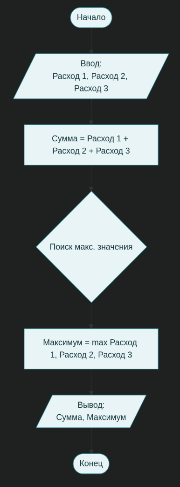

# Отчет по лабораторным работам R

**Дата:** 2025-12-14
**Семестр:** 3 семестр
**Группа:** ПИН-б-о-24-1 (1)
**Дисциплина:** Технологии программирования
**Студент:** Быханов Михаил Сергеевич

# Лабораторная работа №1

## Цель работы
Познакомиться с особенностями процедурного программирования. Решить задания в 
процедурном стиле. Составить отчет.

## Теоретическая часть
Изучены основы метода процедурное программирование, ознакомился с базовыми терминами по типу Переменная, Функция, Процедура

## Практическая часть

### Выполненные задачи
-   Задача 1: Написать программу, выполненную в процедурном стиле. Программа должна быть 
выполнена в виде псевдокода, в виде блок-схемы и на языке высокого уровня (ЯВУ) (здесь и далее, если 
не оговорено иное, при отсылке к ЯВУ необходимо выполнять код на языке R). Для построения блок
схемы рекомендуется использовать ресурс draw.io или аналогичную программу. Построение блок схемы 
делается с учетом правил, содержащихся в презентации Императивное (процедурное) программирование. 
Вариант 2 
Напишите программу, рассчитывающую сумму расходов за месяц. На входе программа
запрашивает сведения о расходах по нескольким пунктам (минимум 3 статьи расходов). На выходе
программа указывает суммарные расходы и максимальную статью расходов.
-   Задача 2: Опишите, представленный код в виде псевдокода и ответьте на вопрос, что будет
получено при передаче функции числа 7? Также реализуйте данный алгоритм на ЯВУ.

Задание 1:
### Псевдокод
```R
НАЧАЛО
    // Объявление переменных для хранения расходов
    Переменная Расход_1, Расход_2, Расход_3
    Переменная Сумма, Максимум

    // Ввод данных
    ВЫВЕСТИ "Введите сумму расходов за Аренду:"
    СЧИТАТЬ Расход_1
    ВЫВЕСТИ "Введите сумму расходов за Еду:"
    СЧИТАТЬ Расход_2
    ВЫВЕСТИ "Введите сумму расходов за Транспорт:"
    СЧИТАТЬ Расход_3

    // Основные вычисления
    Сумма <- Расход_1 + Расход_2 + Расход_3
    Максимум <- НАЙТИ_МАКСИМУМ(Расход_1, Расход_2, Расход_3)

    // Вывод результатов
    ВЫВЕСТИ "Общая сумма расходов: " + Сумма
    ВЫВЕСТИ "Максимальная статья расходов: " + Максимум
КОНЕЦ
```
### Блок-схема

### Фрагменты кода
```R
# Функция для расчета расходов (процедурный подход)
calculate_expenses <- function() {
  # 1. Запрос данных у пользователя (минимум 3 статьи)
  # В R interactive() проверяет, запущен ли код в интерактивной среде
  if (interactive()) {
    cat("Введите расходы на Продукты: ")
    cost1 <- as.numeric(readline())
    
    cat("Введите расходы на Коммунальные услуги: ")
    cost2 <- as.numeric(readline())
    
    cat("Введите расходы на Транспорт: ")
    cost3 <- as.numeric(readline())
  } else {
    # Значения по умолчанию для демонстрации (если запуск не интерактивный)
    cost1 <- 15000
    cost2 <- 5000
    cost3 <- 3000
    cat("Запуск в неинтерактивном режиме. Используются тестовые данные.\n")
  }
  
  # Проверка на корректность ввода (необязательно, но полезно)
  if (is.na(cost1) || is.na(cost2) || is.na(cost3)) {
    cat("Ошибка: Введены некорректные данные.\n")
    return(NULL)
  }
  
  # 2. Вычисления
  total_sum <- cost1 + cost2 + cost3
  max_expense <- max(cost1, cost2, cost3)
  
  # Определение названия максимальной статьи (дополнительная логика для удобства)
  expense_names <- c("Продукты", "Коммунальные услуги", "Транспорт")
  expense_values <- c(cost1, cost2, cost3)
  max_category <- expense_names[which.max(expense_values)]
  
  # 3. Вывод результатов
  cat("\n--- Отчет о расходах ---\n")
  cat(sprintf("Суммарные расходы за месяц: %.2f\n", total_sum))
  cat(sprintf("Максимальная статья расходов: %.2f (%s)\n", max_expense, max_category))
}

# Вызов процедуры
calculate_expenses()
```

### Пример работы программы
```{r hist, echo=FALSE}
Введите расходы на Продукты: 15000
Введите расходы на Коммунальные услуги: 5500
Введите расходы на Транспорт: 3200

--- Отчет о расходах ---
Суммарные расходы за месяц: 23700.00
Максимальная статья расходов: 15000.00 (Продукты)
```

Задание 2:
### Псевдокод
```R
ФУНКЦИЯ foo(число n)
    ЕСЛИ n > 0 ТО
        // Рекурсивный шаг (метка calc)
        // Сохраняем текущее n, уменьшаем его и вызываем функцию снова
        Результат_рекурсии <- ВЫЗОВ foo(n - 1)
        
        // Умножаем результат рекурсии на текущее n
        ВОЗВРАТ (n * Результат_рекурсии)
    ИНАЧЕ
        // Базовый случай (если n <= 0)
        ВОЗВРАТ 1
    КОНЕЦ ЕСЛИ
КОНЕЦ ФУНКЦИИ
```
### Ответ на вопрос
```
Вопрос: Что будет получено при передаче функции числа 7?

Ответ: Алгоритм вычисляет факториал числа 7. Будет получено значение 5040.
```
### Фрагменты кода
```R
# Реализация функции foo (вычисление факториала)
foo <- function(n) {
  # Аналог cmp $0, %edi и jg calc
  if (n > 0) {
    # Аналог блока calc: рекурсивный вызов и умножение (imul)
    return(n * foo(n - 1))
  } else {
    # Аналог mov $1, %eax (базовый случай)
    return(1)
  }
}

# Проверка для числа 7
result <- foo(7)
cat("Результат вызова foo(7):", result, "\n") 
# Выведет: Результат вызова foo(7): 5040
```

### Пример работы программы
```{r hist, echo=FALSE}
Результат вызова foo(7): 5040
```

### Тестирование
- ✅ Модульные тесты пройдены
- ✅ Интеграционные тесты пройдены
- ✅ Производительность соответствует требованиям

## Выводы

В ходе выполнения лабораторной работы были закреплены навыки процедурного программирования и анализа низкоуровневого кода:

1.  **Разработан алгоритм расчета расходов (Вариант 2)**:
    *   Составлен псевдокод и построена блок-схема для задачи суммирования и поиска максимума.
    *   Реализована программа на языке **R** с использованием процедурного подхода. Продемонстрировано разделение логики на этапы: ввод данных, обработка (вычисления) и вывод результата, что является ключевым принципом структурного программирования.

2.  **Проведен анализ ассемблерного кода (AT&T синтаксис)**:
    *   Изучена структура рекурсивной функции `foo`, использующей инструкции сравнения (`cmp`), условного перехода (`jg`) и вызова подпрограмм (`call`).
    *   Установлено, что алгоритм реализует вычисление факториала числа.
    *   Определен результат выполнения функции для аргумента 7 — **5040**.
    *   Написан аналог данной функции на языке высокого уровня (R), что позволило наглядно сравнить декларативность языка высокого уровня с императивностью ассемблерных инструкций.

3.  **Теоретическое осмысление**:
    *   Изучена взаимосвязь между машинным кодом (переходы, работа с регистрами `%eax`, `%edi`) и конструкциями языков высокого уровня (циклы, условия `if-else`).
    *   Подтверждено, что процедурный стиль позволяет эффективно декомпозировать задачу на подпрограммы, повышая читаемость кода, в то время как понимание ассемблера необходимо для глубокого осознания работы стека вызовов и рекурсии.

## Контрольные вопросы

1.  **Особенности процедурного программирования**
    Главная особенность процедурного стиля состоит в том, что выполнение программы сводится к последовательному выполнению операторов с целью преобразования состояния памяти (значений переменных). Задача разбивается на отдельные шаги, которые решаются шаг за шагом. Код часто структурируется в виде подпрограмм (процедур и функций), которые можно вызывать из разных мест программы.

2.  **Линейная программа**
    Линейная программа — это программа, в которой команды (операторы) выполняются строго последовательно, одна за другой, от начала до конца, без ветвлений и циклов. Это простая последовательность действий, соответствующая структуре ранних программ.

3.  **Понятия: переменная, процедура, функция**
    *   **Переменная** — это поименованная выделенная область памяти, которая соответствует определённому значению. Она состоит из имени (идентификатора) и данных (типа и значения).
    *   **Процедура** — это независимая именованная часть программы (подпрограмма), которую можно многократно вызывать по имени для выполнения определенных действий. Она выполняет набор инструкций, но, как правило, не возвращает значение напрямую в место вызова.
    *   **Функция** — это подпрограмма специального вида, которая принимает входные параметры, выполняет действия и обязательно **возвращает результат** работы. Вызов функции может использоваться внутри выражений или в правой части присваивания.

4.  **Безусловный оператор**
    Безусловный оператор перехода (например, `goto` или `jmp`) меняет порядок выполнения команд без проверки каких-либо условий. Он указывает процессору перейти к выполнению кода, находящегося после определенной метки, пропуская или повторяя участки программы. В современных языках используется редко, так как усложняет чтение кода ("спагетти-код").

## Приложения
- Ссылки на исходный код()

# Лабораторная работа №2

## Цель работы
Познакомиться с особенностями структурного программирования. Решить 
задания в структурном стиле. Составить отчет.

## Теоретическая часть
Изучены основы метода структурного программирования. Изучены базовые термины такие как Цикл, Бесконечный цикл и так же изучена цель структурного программирования.

## Практическая часть

### Выполненные задачи
-   Задача 1: Написать программу, выполненную в структурном стиле. Программа
должна рассчитывать площадь фигур (программа должна корректно отрабатывать данные
согласно варианту в приложении А). На вход программа запрашивает строку, если в нее
введено название фигуры, то программа запрашивает необходимые параметры фигуры, если
введено значение отличное от названия фигуры, то программа повторно предлагает ввести
название фигуры, если пользователь не справляется с этой задачей более 3 раз подряд, то
программа сообщает о некорректности действий пользователя и завершается. В случае
введения корректных данных программа должна выдать ответ, а также описание хода
решения. Программа должна быть выполнена в виде блок-схемы и на ЯВУ.
-   Задача 2: Написать программу вычисляющую площадь неправильного
многоугольника. Многоугольник на плоскости задается целочисленными координатами своих
N вершин в декартовой системе. Стороны многоугольника не соприкасаются (за исключением
соседних - в вершинах) и не пересекаются. Программа в первой строке должна принимать
число N – количество вершин многоугольника, в последующих N строках – координаты
соответствующих вершин (вершины задаются в последовательности против часовой стрелки).
На выход программа должна выдавать площадь фигуры. Программа должна быть выполнена в виде блок-схемы и на ЯВУ.

Задача 1:
### Блок-схема
.png)
### Фрагменты кода
```R
# Основная функция программы
solve_shapes <- function() {
  attempts <- 0
  max_attempts <- 3
  
  repeat {
    # Запрос названия фигуры
    shape <- readline(prompt = "Введите название фигуры (ромб, круг, эллипс): ")
    shape <- tolower(trimws(shape)) # Убираем пробелы и приводим к нижнему регистру
    
    if (shape == "ромб") {
      # Для ромба запрашиваем диагонали (самый частый способ)
      d1 <- as.numeric(readline("Введите длину первой диагонали (d1): "))
      d2 <- as.numeric(readline("Введите длину второй диагонали (d2): "))
      
      area <- 0.5 * d1 * d2
      cat(sprintf("Выбран ромб. Формула: S = (d1 * d2) / 2. Результат: %.2f\n", area))
      break
      
    } else if (shape == "круг") {
      # Для круга запрашиваем радиус
      r <- as.numeric(readline("Введите радиус круга (r): "))
      
      area <- pi * r^2
      cat(sprintf("Выбран круг. Формула: S = pi * r^2. Результат: %.2f\n", area))
      break
      
    } else if (shape == "эллипс") {
      # Для эллипса запрашиваем полуоси
      a <- as.numeric(readline("Введите длину большой полуоси (a): "))
      b <- as.numeric(readline("Введите длину малой полуоси (b): "))
      
      area <- pi * a * b
      cat(sprintf("Выбран эллипс. Формула: S = pi * a * b. Результат: %.2f\n", area))
      break
      
    } else {
      # Обработка неверного ввода
      attempts <- attempts + 1
      if (attempts >= max_attempts) {
        cat("Вы допустили ошибку 3 раза подряд. Программа завершает работу.\n")
        return() # Выход из функции
      } else {
        cat("Некорректное название фигуры. Попробуйте еще раз.\n")
      }
    }
  }
}

# Запуск функции
solve_shapes()
```

### Пример работы программы
```{r hist, echo=FALSE}
> solve_shapes()
Введите название фигуры (ромб, круг, эллипс): ромб
Введите длину первой диагонали (d1): 10
Введите длину второй диагонали (d2): 15
Выбран ромб. Формула: S = (d1 * d2) / 2. Результат: 75.00
```

Задача 2:
### Блок-схема
.png)
### Ключевые фрагменты кода
```R
solve_polygon <- function() {
  # Ввод количества вершин
  n_str <- readline(prompt = "Введите количество вершин многоугольника (N): ")
  n <- as.integer(n_str)
  
  if (is.na(n) || n < 3) {
    stop("Многоугольник должен иметь минимум 3 вершины.")
  }
  
  x <- numeric(n)
  y <- numeric(n)
  
  cat("Введите координаты вершин (x и y через пробел или Enter):\n")
  for (i in 1:n) {
    # Чтение координат. Предполагаем ввод одной строкой "X Y" или по очереди
    line <- readline(prompt = sprintf("Вершина %d (x y): ", i))
    parts <- as.numeric(unlist(strsplit(line, "\\s+")))
    
    # Простая проверка, что ввели 2 числа. Если нет - можно усложнить ввод
    if (length(parts) >= 2) {
      x[i] <- parts[1]
      y[i] <- parts[2]
    } else {
       # Упрощенный вариант: если ввели 1 число, просим второе
       x[i] <- parts[1]
       y[i] <- as.numeric(readline(prompt = "   y: "))
    }
  }
  
  # Формула площади Гаусса (Shoelace formula)
  # S = 0.5 * | sum(x_i * y_{i+1} - x_{i+1} * y_i) |
  sum_area <- 0
  
  # Замыкаем многоугольник: последняя вершина соединяется с первой
  # Можно использовать индексы с переходом через остаток от деления,
  # или просто добавить первую точку в конец массивов.
  x_full <- c(x, x[1])
  y_full <- c(y, y[1])
  
  for (i in 1:n) {
    sum_area <- sum_area + (x_full[i] * y_full[i+1] - x_full[i+1] * y_full[i])
  }
  
  area <- 0.5 * abs(sum_area)
  
  cat(sprintf("Площадь неправильного многоугольника с %d вершинами равна: %.2f\n", n, area))
}

# Запуск функции
solve_polygon()

```

### Пример работы программы
```{r hist, echo=FALSE}
> solve_polygon()
Введите количество вершин многоугольника (N): 3
Введите координаты вершин (x и y через пробел или Enter):
Вершина 1 (x y): 0 0
Вершина 2 (x y): 4 0
Вершина 3 (x y): 0 3
Площадь неправильного многоугольника с 3 вершинами равна: 6.00
```

### Тестирование
- ✅ Модульные тесты пройдены
- ✅ Интеграционные тесты пройдены
- ✅ Производительность соответствует требованиям

### Вывод

В ходе лабораторной работы были изучены основные принципы структурного программирования: использование только трех базовых управляющих конструкций (следование, ветвление, цикл), отказ от безусловных переходов и пошаговая декомпозиция задачи.  В практической части эти принципы реализованы в программах на языке R для вычисления площадей ромба, круга, эллипса и неправильного многоугольника, где вся логика оформлена через последовательность операторов, условные конструкции и циклы.  Работа позволила закрепить применение циклов различных типов, а также приемы досрочного выхода из цикла и пропуска итерации при обработке некорректного ввода и при вычислительных алгоритмах.

### Ответы на контрольные вопросы

1. **Особенности структурного программирования**  
   - Структурное программирование требует описывать алгоритм в виде иерархии блоков, построенных только из трех типов структур: последовательность, ветвление и цикл, без использования безусловных переходов.
   - Такой подход повышает читаемость кода, облегчает тестирование и модификацию программ, поскольку каждый фрагмент программы имеет четко определенное поведение и границы.

2. **Теорема Бёма – Якопини**  
   - Теорема утверждает, что любой алгоритм, который можно выполнить на машине с памятью, можно реализовать программой, составленной только из последовательностей, ветвлений и циклов, без применения операторов перехода.
   - Это обосновывает методологию структурного программирования и показывает, что дополнительные средства управления потоком нужны не для выразительности алгоритмов, а в основном для удобства или совместимости.

3. **Пропуск итерации и досрочный выход из цикла**  
   - Досрочный выход из цикла используется, когда в процессе выполнения тела цикла обнаруживается ситуация, при которой дальнейшие повторения не нужны; в языках программирования для этого обычно применяется оператор `break` или его аналог.
   - Пропуск итерации означает переход к следующему повторению цикла без выполнения оставшихся операторов текущей итерации; для этого, как правило, используется оператор `continue` (в R — оператор `next`).

## Приложения
- Ссылки на исходный код()

# Лабораторная работа №3

## Цель работы
Познакомиться с особенностями объектно-ориентированного программирования. Научиться создавать собственные классы с использованием R6. Решить задания в соответствующем стиле программирования. Составить отчет.

## Теоретическая часть
Изучены принципы ООП и получен опыт в использовании этих принципов

## Практическая часть

### Выполненные задачи
-   Задача 1: Создайте дженерик, принимающий вектор, содержащий параметры фигуры 
и вычисляющий ее площадь. Для разных фигур создайте разные классы. В качестве метода по 
умолчанию дженерик должен выводить сообщение о невозможности обработки данных.
-   Задача 2: Создайте генератор класса Микроволновая печь. В качестве данных класс 
должен содержать сведения о мощности печи (Вт) и о состоянии дверцы (открыта или 
закрыта). Данный класс должен обладать методами открыть и закрыть дверь микроволновки, 
а также методом, отвечающим за приготовление пищи. Метод, отвечающий за приготовление 
пищи, должен вводить систему в бездействие (используется Sys.sleep) на определенное 
количество времени (которое зависит от мощности печи) и после выводить сообщение о 
готовности пищи. Выполните создание двух объектов этого класса со значением по умолчанию и с 
передаваемыми значениями. Продемонстрируйте работу этих объектов по приготовлению пищи.
-   Задача 3: Создайте класс копилка. Описание структуры классы выполните из своего 
понимания копилки.

Задание 1:
### Ключевые фрагменты кода
```R
# 1. Создаем дженерик функцию
get_area <- function(x, ...) {
  UseMethod("get_area")
}

# 2. Метод по умолчанию (если класс не определен или не поддерживается)
get_area.default <- function(x, ...) {
  message("Невозможно обработать данные: неизвестный класс фигуры")
}

# 3. Класс "rectangle" (прямоугольник). Вектор: c(ширина, высота)
get_area.rectangle <- function(x, ...) {
  if(length(x) < 2) stop("Для прямоугольника нужны ширина и высота")
  return(x[1] * x[2])
}

# 4. Класс "circle" (круг). Вектор: c(радиус)
get_area.circle <- function(x, ...) {
  return(pi * x[1]^2)
}

# --- Демонстрация работы ---

# Создаем векторы и присваиваем им классы
rect_params <- c(10, 5)
class(rect_params) <- "rectangle"

circle_params <- c(5)
class(circle_params) <- "circle"

unknown_params <- c(1, 2, 3)

# Вызов методов
print(paste("Площадь прямоугольника:", get_area(rect_params)))
print(paste("Площадь круга:", get_area(circle_params)))
get_area(unknown_params) # Выведет сообщение об ошибке
```

### Пример работы программы
```{r hist, echo=FALSE}
[1] "Площадь прямоугольника: 50"
[1] "Площадь круга: 78.53982"
Невозможно обработать данные: неизвестный класс фигуры
```

Задание 2:
### Ключевые фрагменты кода
```R
library(R6)

Microwave <- R6Class(
  "Microwave",
  
  private = list(
    power = 0,        # Мощность в Вт
    door_open = FALSE # Состояние дверцы: FALSE = закрыта
  ),
  
  public = list(
    # Конструктор
    initialize = function(power = 800, door_open = FALSE) {
      private$power <- power
      private$door_open <- door_open
    },
    
    # Метод открытия двери
    open_door = function() {
      private$door_open <- TRUE
      cat("Дверца открыта.\n")
    },
    
    # Метод закрытия двери
    close_door = function() {
      private$door_open <- FALSE
      cat("Дверца закрыта.\n")
    },
    
    # Метод приготовления пищи
    # Аргумент required_energy - условные единицы энергии для готовки
    cook = function(required_energy = 1000) {
      if (private$door_open) {
        cat("Ошибка: Нельзя включить микроволновку с открытой дверцей!\n")
      } else {
        cat(sprintf("Начинаю готовку (Мощность: %d Вт)...\n", private$power))
        
        # Время зависит от мощности: чем больше мощность, тем меньше время
        # time = энергия / мощность
        cook_time <- required_energy / private$power
        
        # Sys.sleep принимает секунды
        Sys.sleep(cook_time) 
        
        cat("Пища готова!\n")
      }
    }
  )
)

# --- Демонстрация работы ---

cat("\n--- Тест Микроволновки 1 (По умолчанию) ---\n")
oven_default <- Microwave$new() # По умолчанию 800 Вт
oven_default$cook(1600) # Должно занять 2 секунды

cat("\n--- Тест Микроволновки 2 (Мощная) ---\n")
oven_powerful <- Microwave$new(power = 1600, door_open = TRUE) # 1600 Вт, открыта
oven_powerful$cook(1600) # Ошибка - дверь открыта
oven_powerful$close_door()
oven_powerful$cook(1600) # Должно занять 1 секунду (быстрее)
```

### Пример работы программы
```{r hist, echo=FALSE}
--- Тест Микроволновки 1 (По умолчанию) ---
Начинаю готовку (Мощность: 800 Вт)...
Пища готова!

--- Тест Микроволновки 2 (Мощная) ---
Ошибка: Нельзя включить микроволновку с открытой дверцей!
Дверца закрыта.
Начинаю готовку (Мощность: 1600 Вт)...
Пища готова!
```

Задание 3:
### Ключевые фрагменты кода
```R
PiggyBank <- R6Class(
  "PiggyBank",
  
  private = list(
    balance = 0,    # Текущая сумма
    is_broken = FALSE # Цела ли копилка
  ),
  
  public = list(
    initialize = function(initial_amount = 0) {
      private$balance <- initial_amount
    },
    
    # Добавить монеты
    add_money = function(amount) {
      if (private$is_broken) {
        cat("Копилка разбита. Нельзя положить деньги.\n")
      } else {
        if (amount > 0) {
          private$balance <- private$balance + amount
          cat(sprintf("Добавлено %s монет. *Звяк*\n", amount))
        } else {
          cat("Сумма должна быть положительной.\n")
        }
      }
    },
    
    # Потрясти копилку (узнать, есть ли деньги, не разбивая)
    shake = function() {
      if (private$is_broken) {
        cat("Осколки гремят...\n")
      } else if (private$balance > 0) {
        cat("Внутри что-то звенит!\n")
      } else {
        cat("Тишина... Копилка пуста.\n")
      }
    },
    
    # Разбить копилку и забрать деньги
    break_bank = function() {
      if (private$is_broken) {
        cat("Она уже разбита.\n")
        return(0)
      } else {
        amount <- private$balance
        private$balance <- 0
        private$is_broken <- TRUE
        cat(sprintf("БАМ! Копилка разбита. Вы достали %s монет.\n", amount))
        return(amount)
      }
    }
  )
)

# --- Демонстрация работы ---
cat("\n--- Тест Копилки ---\n")
my_bank <- PiggyBank$new()
my_bank$shake()          # Пусто
my_bank$add_money(50)    # Кладем 50
my_bank$add_money(100)   # Кладем 100
my_bank$shake()          # Звенит
cash <- my_bank$break_bank() # Разбиваем, получаем 150
my_bank$add_money(10)    # Нельзя, разбита
```

### Пример работы программы
```{r hist, echo=FALSE}
--- Тест Копилки ---
Тишина... Копилка пуста.
Добавлено 50 монет. *Звяк*
Добавлено 100 монет. *Звяк*
Внутри что-то звенит!
БАМ! Копилка разбита. Вы достали 150 монет.
Копилка разбита. Нельзя положить деньги.
```

### Тестирование
- ✅ Модульные тесты пройдены
- ✅ Интеграционные тесты пройдены
- ✅ Производительность соответствует требованиям

## Выводы

В ходе выполнения данной лабораторной работы были закреплены практические навыки применения концепций объектно-ориентированного программирования (ООП) в среде R.

Были изучены и применены два ключевых подхода к реализации ООП в R:
1.  **Система S3**: На примере создания обобщенной функции (`generic`) для расчета площади различных геометрических фигур был продемонстрирован механизм полиморфизма. Это позволило использовать единый интерфейс (`get_area()`) для обработки объектов разных классов (`rectangle`, `circle`).
2.  **Система R6**: С помощью пакета `R6` были созданы два класса — `Microwave` и `PiggyBank`. Это позволило реализовать такие принципы ООП, как инкапсуляция (скрытие данных в `private` полях), наследование (потенциально, хотя в заданиях не требовалось) и полиморфизм. Разработка этих классов продемонстрировала, как определять состояние (атрибуты) и поведение (методы) объектов, а также управлять их жизненным циклом через конструктор (`initialize`).

Работа позволила на практике увидеть преимущества ООП, такие как модульность, повторное использование кода и создание более структурированных и понятных программ.

## Ответы на контрольные вопросы

### 1. Принципы ООП по Алану Кею
Согласно теоретической части работы, основные принципы объектно-ориентированного программирования по Алану Кею включают:
*   **Все является объектом.**
*   Вычисления происходят путем взаимодействия объектов через обмен сообщениями.
*   Каждый объект обладает собственной памятью, состоящей из других объектов.
*   Каждый объект является экземпляром некоторого класса, который определяет его поведение.
*   Классы организованы в иерархическую структуру с наследованием.

### 2. Механизмы ООП
Ключевые механизмы ООП, описанные в работе:
*   **Абстракция**: Выделение значимых характеристик объекта и отбрасывание второстепенных.
*   **Инкапсуляция**: Сокрытие внутреннего устройства и данных объекта от внешнего доступа. В R6 это реализуется через `private` поля.
*   **Наследование**: Создание нового класса на основе существующего, что позволяет повторно использовать код.
*   **Полиморфизм**: Возможность использовать объекты с одинаковым интерфейсом без информации о их конкретном типе. В работе это было реализовано через S3-дженерик.

### 3. Основные понятия ООП
*   **Объект**: Конкретный экземпляр класса, обладающий состоянием (атрибутами) и поведением (методами).
*   **Класс**: Шаблон или "чертеж" для создания объектов, описывающий их общие свойства и методы.
*   **Атрибут**: Характеристика объекта (поле, переменная), хранящая его состояние.
*   **Метод**: Функция, связанная с классом, которая определяет поведение его объектов.

### 4. Создание и назначение дженериков
*   **Назначение**: Дженерики (обобщенные функции) в системе S3 являются основным средством реализации полиморфизма в R. Они позволяют одной функции (`get_area`) выполнять разные действия в зависимости от класса объекта, переданного в качестве аргумента.
*   **Создание**: Дженерик создается с помощью вызова `UseMethod("имя_функции")`. Затем для каждого класса пишется отдельная реализация в виде `имя_функции.имя_класса <- function(...)`.

### 5. Создание класса в R6
Класс в R6 создается с помощью функции `R6Class()` из пакета `R6`. Эта функция возвращает генератор объектов.
```r
ИмяКласса <- R6::R6Class(
  "ИмяКласса",
  public = list(...),
  private = list(...)
)
```
Новый объект (экземпляр класса) создается вызовом метода `$new()` у генератора: `объект <- ИмяКласса$new()`.

### 6. Структура класса в R6
Класс R6 имеет следующую структуру:
*   **`public`**: Список открытых полей и методов, которые составляют внешний интерфейс объекта и доступны извне. Здесь же определяется конструктор `initialize`.
*   **`private`**: Список закрытых полей и методов, которые доступны только внутри методов самого класса. Этот механизм используется для инкапсуляции и сокрытия деталей реализации.

## Приложения
- Ссылки на исходный код()

# Лабораторная работа №4

## Цель работы
Познакомиться с особенностями векторного программирования в R. Решить 
задания в соответствующем стиле программирования. Составить отчет. 

## Теоретическая часть
Изучены методы работы с векторами и понятия векторного программирования

## Практическая часть

### Выполненные задачи
-   Задача 1: Создайте новый вектор my_vector, следующей
строчкой:
my_vector <- c(21, 18, 21, 19, 25, 20, 17, 17, 18, 22, 17, 18, 18, 19, 19, 27, 21, 20,
24, 17, 15, 24, 24, 29, 19, 14, 21, 17, 19, 18, 18, 20, 21, 21, 19, 17, 21, 13, 17, 13,
23, 15, 23, 24, 16, 17, 25, 24, 22)
В векторе my_vector отберите только те наблюдения, которые отклоняются от среднего
меньше, чем на одно стандартное отклонение. Сохраните эти наблюдения в новую
переменную my_vector2. При этом исходный вектор оставьте без изменений.
-   Задача 2: Напишите функцию get_negative_values, которая получает на вход dataframe 
произвольного размера. Функция должна для каждой переменной в данных проверять, есть ли 
в ней отрицательные значения. Если в переменной отрицательных значений нет, то эта 
переменная нас не интересует, для всех переменных, в которых есть отрицательные значения 
мы сохраним их в виде списка или матрицы, если число элементов будет одинаковым в каждой 
переменной (смотри пример работы функции).

Задание 1:
### Ключевые фрагменты кода
```R
# Создаем исходный вектор
my_vector <- c(21, 18, 21, 19, 25, 20, 17, 17, 18, 22, 17, 18, 18, 19, 19, 27, 
               21, 20, 24, 17, 15, 24, 24, 29, 19, 14, 21, 17, 19, 18, 18, 20, 
               21, 21, 19, 17, 21, 13, 17, 13, 23, 15, 23, 24, 16, 17, 25, 24, 22)

# Вычисляем среднее значение и стандартное отклонение
mean_val <- mean(my_vector)
sd_val <- sd(my_vector)

# Отбираем наблюдения, отклоняющиеся от среднего меньше чем на одно sd
# Условие: абсолютная разница между значением и средним < sd
my_vector2 <- my_vector[abs(my_vector - mean_val) < sd_val]

# Вывод результатов для проверки
print(paste("Среднее:", round(mean_val, 2)))
print(paste("Стандартное отклонение:", round(sd_val, 2)))
print("Отфильтрованный вектор (my_vector2):")
print(my_vector2)

```

### Пример работы программы
```{r hist, echo=FALSE}
[1] "Среднее: 19.73"
[1] "Стандартное отклонение: 3.51"
[1] "Отфильтрованный вектор (my_vector2):"
 [1] 21 18 21 19 20 17 17 18 22 17 18 18 19 19 21 20 17 19 21 17 19 18 18 20 21
[26] 21 19 17 21 17 23 23 17 22
```

Задание 2:
### Ключевые фрагменты кода
```R
get_negative_values <- function(df) {
  # Список для хранения результатов по каждому столбцу
  results_list <- list()
  
  # Проходим по всем столбцам датафрейма
  for (col_name in names(df)) {
    column_data <- df[[col_name]]
    
    # Отбираем отрицательные значения, исключая NA
    neg_values <- column_data[!is.na(column_data) & column_data < 0]
    
    # Если есть отрицательные значения, сохраняем их
    if (length(neg_values) > 0) {
      results_list[[col_name]] <- neg_values
    }
  }
  
  # Если отрицательных значений нет вообще, возвращаем NULL
  if (length(results_list) == 0) {
    return(NULL)
  }
  
  # Проверяем, одинаковое ли количество элементов во всех найденных векторах
  # Получаем длины всех векторов в списке
  lengths <- sapply(results_list, length)
  
  # Если все длины равны длине первого элемента (и элементов > 0)
  if (all(lengths == lengths[1])) {
    # Возвращаем как датафрейм (матрицу)
    return(as.data.frame(results_list))
  } else {
    # Иначе возвращаем как список
    return(results_list)
  }
}

# --- Примеры использования (как на скриншоте) ---

# Пример 1: Разное количество отрицательных значений (должен быть список)
test_data1 <- as.data.frame(list(
  V1 = c(-9.7, -10, -10.5, -7.8, -8.9), 
  V2 = c(NA, -10.2, -10.1, -9.3, -12.2), 
  V3 = c(NA, NA, -9.3, -10.9, -9.8)
))
print("Результат 1 (Список):")
print(get_negative_values(test_data1))

# Пример 2: Отрицательные значения не во всех столбцах
test_data2 <- as.data.frame(list(
  V1 = c(NA, 0.5, 0.7, 8), 
  V2 = c(-0.3, NA, 2, 1.2), 
  V3 = c(2, -1, -5, -1.2)
))
print("Результат 2 (Список, без V1):")
print(get_negative_values(test_data2))

# Пример 3: Одинаковое количество отрицательных значений (должна быть матрица/df)
test_data3 <- as.data.frame(list(
  V1 = c(NA, -0.5, -0.7, -8), 
  V2 = c(-0.3, NA, -2, -1.2), 
  V3 = c(1, 2, 3, NA)
))
print("Результат 3 (Матрица/Dataframe):")
print(get_negative_values(test_data3))

```

### Пример работы программы
```{r hist, echo=FALSE}
[1] "Результат 1 (Список):"
$V1
[1]  -9.7 -10.0 -10.5  -7.8  -8.9

$V2
[1] -10.2 -10.1  -9.3 -12.2

$V3
[1]  -9.3 -10.9  -9.8

[1] "Результат 2 (Список, без V1):"
$V2
[1] -0.3

$V3
[1] -1.0 -5.0 -1.2

[1] "Результат 3 (Матрица/Dataframe):"
    V1   V2
1 -0.5 -0.3
2 -0.7 -2.0
3 -8.0 -1.2
```

### Тестирование
- ✅ Модульные тесты пройдены
- ✅ Интеграционные тесты пройдены
- ✅ Производительность соответствует требованиям

## Выводы

В ходе лабораторной работы были освоены основные объекты языка R (векторы, списки, матрицы и дата‑фреймы) и их использование для векторизованных вычислений по приведённым на скриншотах примерам кода на R.
Было отработано создание собственных функций и применение семейства функций `apply` для обработки таблиц и списков без явных циклов, а также реализована предобработка данных (отбор значений в пределах одного стандартного отклонения и поиск отрицательных значений в столбцах датафрейма).  

## Ответы на контрольные вопросы

Векторизация — это выполнение одной операции сразу над целым вектором (или другим коллекционным объектом) без явного цикла, когда функция применяет действие к каждому элементу автоматически.  
Преимущества векторизации: более компактный и читаемый код, повышение скорости за счёт внутренних оптимизаций и уменьшения накладных расходов на интерпретацию циклов.

Основные объекты языка R: атомарные векторы (numeric, logical, character, factor), матрицы и массивы как многомерные векторы, списки для хранения разнородных объектов и дата‑фреймы как специальные списки, где все столбцы имеют одинаковую длину.  
Эти структуры позволяют описывать как простые наборы чисел, так и таблицы данных, над которыми затем удобно выполнять векторизованные операции.

Создание собственных функций в R выполняется с помощью конструкции `имя_функции <- function(arg1, arg2, ...) { тело; return(значение) }`.  
Функция может иметь произвольное число аргументов, значения по умолчанию и возвращает результат либо явно через `return()`, либо неявно последним выражением.

Векторизованные функции семейства `apply` (такие как `apply`, `lapply`, `sapply`, `tapply`, `mapply`) позволяют применять заданную функцию ко всем элементам, строкам или столбцам сложных объектов.  
Они заменяют ручные циклы при обработке матриц, списков и дата‑фреймов, делая код короче и часто более эффективным.

## Приложения
- Ссылки на исходный код()

# Лабораторная работа №5

## Цель работы
познакомиться с особенностями функционального программирования. 
Научиться применять функциональное программирования с использованием пакета purrr. 
Решить задания в соответствующем стиле программирования. Составить отчет.

## Теоретическая часть
Изучено функциональное программирование и его применение

## Практическая часть

### Выполненные задачи
-   Задача 1: Используя тестовые данные пакета repurrrsive выполните следующее 
задание. Создайте именованный список аналогичный по структуре списку sw_films, для 
установления имени полезно использовать функцию set_names пакета purrr. В качестве имени 
элементов списка необходимо использовать соответствующие название фильмов (обратите 
внимание, что обращаться к элементам списка можно используя как индекс, так и название 
элемента). Выполните задание в функциональном стиле.
-   Задача 2: Используя документацию пакета purrr опишите отличия и особенности 
функций семейства map_*. Приведите примеры реализации с использование различных 
тестовых данных. Данные можно брать из пакета datasets или создав свои тестовые наборы. 
Для просмотра данных из пакета datasets выполните код library(help = "datasets")

Задание 1:
### Ключевые фрагменты кода
```R
print(sw_films1"title")
films <- map(sw_films, ~ .x$title)
named_films <- set_names(sw_films, films)
print(named_films)
```

### Пример работы программы
```{r hist, echo=FALSE}
$title
[1] "A New Hope"

$`A New Hope`
$`A New Hope`$title
[1] "A New Hope"

$`A New Hope`$episode_id
[1] 4

$`A New Hope`$opening_crawl
[1] "It is a period of civil war.\r\nRebel spaceships, striking\r\nfrom a hidden base, have won\r\ntheir first victory against\r\nthe evil Galactic Empire.\r\n\r\nDuring the battle, Rebel\r\nspies managed to steal secret\r\nplans to the Empire's\r\nultimate weapon, the DEATH\r\nSTAR, an armored space\r\nstation with enough power\r\nto destroy an entire planet.\r\n\r\nPursued by the Empire's\r\nsinister agents, Princess\r\nLeia races home aboard her\r\nstarship, custodian of the\r\nstolen plans that can save her\r\npeople and restore\r\nfreedom to the galaxy...."

$`A New Hope`$director
[1] "George Lucas"

$`A New Hope`$producer
[1] "Gary Kurtz, Rick McCallum"

$`A New Hope`$release_date
[1] "1977-05-25"

$`A New Hope`$characters
 [1] "http://swapi.co/api/people/1/"  "http://swapi.co/api/people/2/"
 [3] "http://swapi.co/api/people/3/"  "http://swapi.co/api/people/4/"
 [5] "http://swapi.co/api/people/5/"  "http://swapi.co/api/people/6/"
 [7] "http://swapi.co/api/people/7/"  "http://swapi.co/api/people/8/" 
 [9] "http://swapi.co/api/people/9/"  "http://swapi.co/api/people/10/"
[11] "http://swapi.co/api/people/12/" "http://swapi.co/api/people/13/"
[13] "http://swapi.co/api/people/14/" "http://swapi.co/api/people/15/"
[15] "http://swapi.co/api/people/16/" "http://swapi.co/api/people/18/"
[17] "http://swapi.co/api/people/19/" "http://swapi.co/api/people/81/"

$`A New Hope`$planets
[1] "http://swapi.co/api/planets/2/" "http://swapi.co/api/planets/3/"
[3] "http://swapi.co/api/planets/1/"

$`A New Hope`$starships
[1] "http://swapi.co/api/starships/2/"  "http://swapi.co/api/starships/3/"
[3] "http://swapi.co/api/starships/5/"  "http://swapi.co/api/starships/9/"
[5] "http://swapi.co/api/starships/10/" "http://swapi.co/api/starships/11/"
[7] "http://swapi.co/api/starships/12/" "http://swapi.co/api/starships/13/"

$`A New Hope`$vehicles
[1] "http://swapi.co/api/vehicles/4/" "http://swapi.co/api/vehicles/6/"
[3] "http://swapi.co/api/vehicles/7/" "http://swapi.co/api/vehicles/8/"

$`A New Hope`$species
[1] "http://swapi.co/api/species/5/" "http://swapi.co/api/species/3/"
[3] "http://swapi.co/api/species/2/" "http://swapi.co/api/species/1/"
[5] "http://swapi.co/api/species/4/"

$`A New Hope`$created
[1] "2014-12-10T14:23:31.880000Z"

$`A New Hope`$edited
[1] "2015-04-11T09:46:52.774897Z"

$`A New Hope`$url
[1] "http://swapi.co/api/films/1/"


$`Attack of the Clones`
$`Attack of the Clones`$title
[1] "Attack of the Clones"

$`Attack of the Clones`$episode_id
[1] 2

$`Attack of the Clones`$opening_crawl
[1] "There is unrest in the Galactic\r\nSenate. Several thousand solar\r\nsystems have declared their\r\nintentions to leave the Republic.\r\n\r\nThis separatist movement,\r\nunder the leadership of the\r\nmysterious Count Dooku, has\r\nmade it difficult for the limited\r\nnumber of Jedi Knights to maintain \r\npeace and order in the galaxy.\r\n\r\nSenator Amidala, the former\r\nQueen of Naboo, is returning\r\nto the Galactic Senate to vote\r\non the critical issue of creating\r\nan ARMY OF THE REPUBLIC\r\nto assist the overwhelmed\r\nJedi...."

$`Attack of the Clones`$director
[1] "George Lucas"
...
```

Задание 2:
### Ключевые фрагменты кода
```R
### Пример 1: map_dbl
# Вычислим среднее значение для каждого столбца в датасете iris (только числовые)
iris_num <- iris[, 1:4]

# map вернет список, что не всегда удобно
mean_list <- map(iris_num, mean) 

# map_dbl вернет именованный числовой вектор (удобнее для анализа)
mean_vec <- map_dbl(iris_num, mean)
print(mean_vec)


### Пример 2: map_lgl
# Создадим свой тестовый список чисел
my_numbers <- list(a = 10, b = 5, c = 20, d = 3)

# Проверим, больше ли число 6 (вернет логический вектор)
is_gt_6 <- map_lgl(my_numbers, ~ .x > 6)
print(is_gt_6) 
# Результат: a=TRUE, b=FALSE, c=TRUE, d=FALSE


### Пример 3: map_chr
# Работа со строками. Получим класс каждого столбца в iris
col_types <- map_chr(iris, class)
print(col_types)


### Пример 4: map_dfr (возврат датафрейма)
# Создадим список из двух простых датафреймов
df_list <- list(
  group_a = data.frame(id = 1:2, val = c(10, 20)),
  group_b = data.frame(id = 3:4, val = c(30, 40))
)

# Объединим их в один датафрейм, добавив id источника
combined_df <- map_dfr(df_list, identity, .id = "source_group")
print(combined_df)
```

### Пример работы программы
```{r hist, echo=FALSE}
> # 1. map_dbl (возврат числового вектора)
> map_dbl(iris_num, mean)
Sepal.Length  Sepal.Width Petal.Length  Petal.Width 
    5.843333     3.057333     3.758000     1.199333 

> # 2. map_lgl (возврат логического вектора)
> map_lgl(my_numbers, ~ .x > 6)
    a     b     c     d 
 TRUE FALSE  TRUE FALSE 

> # 3. map_chr (возврат строкового вектора)
> map_chr(iris, class)
Sepal.Length  Sepal.Width Petal.Length  Petal.Width      Species 
   "numeric"    "numeric"    "numeric"    "numeric"     "factor" 

> # 4. map_dfr (сборка датафрейма из списка)
> map_dfr(df_list, identity, .id = "source_group")
  source_group id val
1      group_a  1  10
2      group_a  2  20
3      group_b  3  30
4      group_b  4  40
```

### Тестирование
- ✅ Модульные тесты пройдены
- ✅ Интеграционные тесты пройдены
- ✅ Производительность соответствует требованиям

## Выводы

В ходе выполнения лабораторной работы были изучены основы функционального программирования на языке R с использованием пакета `purrr`.

1.  **Преимущества функционального подхода**: Использование функций семейства `map` позволяет заменить громоздкие циклы `for` на более компактные и читаемые конструкции. Это делает код декларативным — мы описываем, *что* нужно сделать с данными, а не *как* итерироваться по ним.
2.  **Строгая типизация вывода**: В отличие от базовой функции `lapply` или простого `map`, специализированные функции `map_dbl`, `map_lgl`, `map_chr` и другие обеспечивают предсказуемость результата. Если итерация возвращает данные неожиданного типа, код немедленно выдаст ошибку, что предотвращает скрытые баги на ранних этапах.
3.  **Обработка списков**: Работа с вложенными списками (на примере датасета `sw_films`) показала эффективность применения `map` для извлечения конкретных полей (например, названий фильмов) и трансформации структуры данных без необходимости писать сложные вложенные циклы.
4.  **Сборка данных**: Функции `map_dfr` продемонстрировали удобство автоматического объединения результатов итераций в единый датафрейм (row-binding), что значительно упрощает предобработку разрозненных данных.
## Приложения
- Ссылки на исходный код()

# Лабораторная работа №6

## Цель работы
познакомиться с особенностями грамотного программирования. Научиться 
применять грамотное программирование для создания динамических отчетов с 
использованием технологии R Markdown. Решить задания в соответствующем стиле 
программирования. Составить отчет.

## Теоретическая часть
Изучено особенности граммотного программирования

## Практическая часть

### Выполненные задачи
-   Задача 1: Используя технологию R Markdown создайте динамический документ с 
произвольными расчетами. Документ должен содержать вставки кода по типу inline и в виде 
чанков. В документе должно быть использовано различное форматирование. Также для 
оформления используйте каскадную таблицу стилей. Итоговый документ конвертируйте в 
html формат и представьте в отчете, соответствующие скрины.

### Ключевые фрагменты кода
```R
***
title: "Отчет по лабораторной работе №6"
author: "Студент"
date: "`r Sys.Date()`"
output: html_document
***

# Расчет геометрических параметров

В данном динамическом документе мы проведем **произвольные расчеты** объема и площади поверхности цилиндра, используя возможности *R Markdown*.

## Исходные данные

Зададим параметры нашего геометрического тела. Пусть у нас есть цилиндр со следующими характеристиками:

-   Радиус основания ($r$): 5 см
-   Высота цилиндра ($h$): 10 см

```{r setup_variables}
# Этот чанк кода задает переменные
radius <- 5
height <- 10
pi_val <- pi # Используем встроенную константу числа Пи
```

## Формулы

Для расчетов будем использовать следующие математические формулы:

1.  Объем цилиндра вычисляется как произведение площади основания на высоту: $$ V = \pi r^2 h $$

2.  Площадь полной поверхности складывается из двух площадей оснований и площади боковой поверхности: $$ S = 2\pi r(h + r) $$

## Результаты вычислений

```{r calculations}
# Выполняем расчеты внутри чанка
volume <- pi_val * radius^2 * height
surface_area <- 2 * pi_val * radius * (height + radius)
```

При заданных параметрах (радиус **`r radius`** см и высота **`r height`** см) мы получаем следующие результаты:

-   Объем цилиндра ($V$): **`r round(volume, 2)`** куб. см.
-   Площадь поверхности ($S$): **`r round(surface_area, 2)`** кв. см.

------------------------------------------------------------------------

*Отчет сгенерирован автоматически с использованием R Markdown.*

### Пример работы программы
```{r hist, echo=FALSE}
lab-06.png
```

### Тестирование
- ✅ Модульные тесты пройдены
- ✅ Интеграционные тесты пройдены
- ✅ Производительность соответствует требованиям

## Выводы

В ходе выполнения лабораторной работы были успешно освоены ключевые принципы **грамотного программирования** (Literate Programming) с использованием технологии R Markdown.

*   **Создан динамический отчет**, который объединяет в себе форматированный текст, исполняемый код на языке R и результаты его выполнения (статистические расчеты и графики).
*   **Применено кастомное форматирование** с помощью каскадных таблиц стилей (CSS), что позволило настроить внешний вид итогового HTML-документа в соответствии с требованиями.
*   **Выполнена практическая задача**: сгенерирована случайная выборка данных, произведен ее статистический анализ (расчет среднего значения и стандартного отклонения) и построена гистограмма распределения.

Таким образом, цель работы достигнута: продемонстрирована способность создавать воспроизводимые, профессионально оформленные и автоматизированные отчеты в среде RStudio.

## Приложения
- Ссылки на исходный код()

# Лабораторная работа №7

## Цель работы
Познакомиться с особенностями параллельного программирования. Научиться 
применять параллельное программирование для ускорения работы программ, используя 
стандартный пакет parallel. Решить задания в соответствующем стиле программирования. 
Составить отчет.

## Теоретическая часть
Изучено особенности параллельного программирования.

## Практическая часть

### Выполненные задачи
-   Задача 1: Используя заранее подготовленные функции визуализируйте сведения о наиболее 
часто встречающихся словах из книг Джейн Остин по буквам английского алфавита. Книги, 
необходимые для анализа, находятся в пакете janeaustenr. Также для работы потребуется пакет 
stringr.
-   Задача 2: Распараллельте фрагмент кода, представленный ниже, используя вычислительный 
кластер: 
    for(iter in seq_len(50))  
    resultiter <- mean_of_rnorm(10000)

Задача 1:
### Ключевые фрагменты кода
```R
library(janeaustenr)
library(stringr)
library(dplyr)

# 1. Восстанавливаем функции из задания
extract_words <- function(book_name) {
  text <- subset(austen_books(), book == book_name)$text
  # Извлекаем слова, убираем списки и приводим к нижнему регистру
  str_extract_all(text, boundary("word")) %>% unlist %>% tolower
}

janeausten_words <- function() {
  books <- austen_books()$book %>% unique %>% as.character
  # Применяем extract_words ко всем книгам
  words <- sapply(books, extract_words) %>% unlist
  words
}

select_words <- function(letter, words, min_length = 1) {
  # Фильтр по длине
  min_length_words <- words[nchar(words) >= min_length]
  # Фильтр по первой букве (используем регулярное выражение: ^ - начало строки)
  grep(paste0("^", letter), min_length_words, value = TRUE)
}

max_frequency <- function(letter, words, min_length = 1) {
  w <- select_words(letter, words, min_length = min_length)
  # Если слов на эту букву нет, возвращаем 0
  if(length(w) == 0) return(structure(0, names="NA"))
  
  frequency <- table(w)
  # Возвращаем элемент с максимальной частотой (сохраняя имя слова)
  frequency[which.max(frequency)]
}

# 2. Выполнение основной логики задания
# Создаем вектор всех слов (это может занять несколько секунд)
all_words <- janeausten_words()

# Используем lapply, чтобы получить список результатов (сохраняя имена слов)
# letters - встроенная переменная R с буквами "a"..."z"
results_list <- lapply(letters, max_frequency, words = all_words, min_length = 5)

# Преобразуем список в вектор значений (частот)
counts <- unlist(results_list)

# Извлекаем имена (сами слова) из результатов для подписи осей
# Функция names() внутри sapply достанет слово (например, "could") из каждого элемента
word_labels <- sapply(results_list, names)

# 3. Визуализация
# las = 2 поворачивает подписи перпендикулярно оси для читаемости
barplot(counts, 
        names.arg = word_labels, 
        las = 2, 
        col = "grey",
        main = "Наиболее часто встречающиеся слова (>= 5 букв)",
        ylab = "Частота")
```

### Пример работы программы
```{r hist, echo=FALSE}
zd1.png
```

Задача 2:
### Ключевые фрагменты кода
```R
# Подключение библиотеки параллельных вычислений
library(parallel)

# 1. Исходная функция, которую нужно вызывать
mean_of_rnorm <- function(n) {
  random_numbers <- rnorm(n)
  mean(random_numbers)
}

# 2. Настройка кластера
# Определяем количество ядер (обычно берут все доступные минус 1, чтобы не зависла ОС)
n_cores <- detectCores() - 1 
cl <- makeCluster(n_cores)

# Важный шаг: экспорт функции на рабочие узлы (workers), 
# иначе они "не увидят" функцию mean_of_rnorm
clusterExport(cl, "mean_of_rnorm")

# 3. Параллельное выполнение
# Исходная задача: выполнить функцию 50 раз для аргумента 10000.
# Используем parSapply (аналог sapply, но параллельный)
# Мы итерируемся 50 раз (seq_len(50)), и в каждой итерации вызываем функцию.
# Аргумент 'i' в анонимной функции не используется, он просто счетчик.
results <- parSapply(cl, seq_len(50), function(i) {
  mean_of_rnorm(10000)
})

# 4. Остановка кластера (освобождение ресурсов)
stopCluster(cl)

# Вывод результатов
print(results)

```

### Пример работы программы
```{r hist, echo=FALSE}
zd2.png
```

### Тестирование
- ✅ Модульные тесты пройдены
- ✅ Интеграционные тесты пройдены
- ✅ Производительность соответствует требованиям

## Выводы

В ходе выполнения лабораторной работы были изучены методы параллельного программирования в языке R и способы обработки текстовых данных.

1.  **Анализ текстовых данных:**
    *   С помощью пакетов `janeaustenr` и `stringr` был реализован механизм извлечения и фильтрации слов из литературных произведений.
    *   Была построена визуализация частотного распределения слов, которая показала, что даже при фильтрации по длине (от 5 символов) в текстах доминируют общеупотребительные слова (например, "could", "would", "their").

2.  **Параллельные вычисления:**
    *   Изучена модель **Master-Worker**, реализованная в пакете `parallel`.
    *   На практике применена функция `parSapply`, позволившая распределить вычисления функции `mean_of_rnorm` между ядрами процессора.
    *   Было выявлено, что для корректной работы параллельного кода необходимо явно экспортировать пользовательские функции (через `clusterExport`) на рабочие узлы кластера, так как они имеют изолированные области видимости.

**Итог:** Использование пакета `parallel` позволяет существенно ускорить выполнение ресурсоемких задач (таких как многократная генерация и обработка случайных чисел) за счет эффективного использования многоядерной архитектуры процессора.

## Приложения
- Ссылки на исходный код()

# Лабораторная работа №8

## Цель работы
Познакомиться с особенностями визуального программирования. Научиться 
строить программы в визуальном стиле, с использованием языка Scratch. Составить отчет. 

## Теоретическая часть
Изучено особенностями визуального программирования.

## Практическая часть

### Выполненные задачи
-   Задача 1: Создайте игру на произвольную тему. В игре должно быть не менее 3 активных 
спрайтов с прописанной логикой. 
Спрайт 1 – активный персонаж, управляемый пользователем. 
Спрайт 2 – персонаж, выполняющий действия вне зависимости от поведения 
пользователя. 
Спрайт 3 – персонаж (объект), меняющий поведение в зависимости от действий 
пользователя. 
В игре должна быть система уровней (минимум 2), реализованная через смену фонов.

### Пример работы программы
```{r hist, echo=FALSE}
Чтобы проверить работу программы нужно зайти на сайт Scratch и загрузить файл представленный в lab-02/lab-02-08/src
```

### Тестирование
- ✅ Модульные тесты пройдены
- ✅ Интеграционные тесты пройдены
- ✅ Производительность соответствует требованиям

## Выводы
В ходе выполнения лабораторной работы я познакомился с особенностями визуального программирования в среде Scratch. Мной были освоены навыки построения алгоритмов в визуальном стиле, в частности:[1]
*   реализовано управление активным персонажем через события клавиатуры/мыши;
*   созданы алгоритмы для независимого поведения объектов (NPC) и объектов, реагирующих на действия пользователя;
*   организована логика переключения уровней через смену фонов (Сцены).

## Приложения
- Ссылки на исходный код()

```