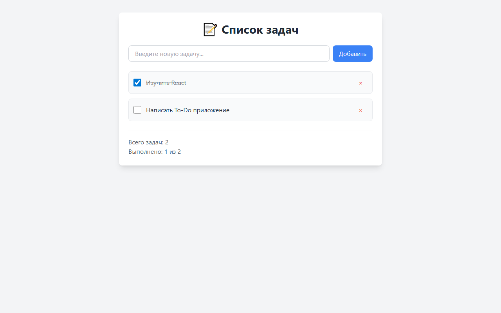
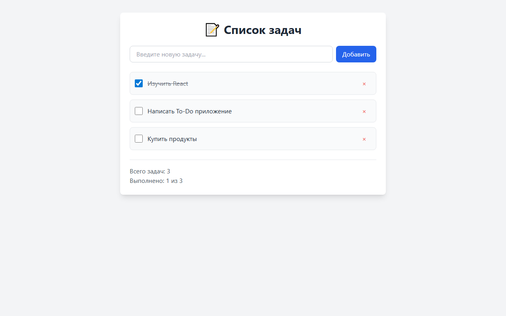
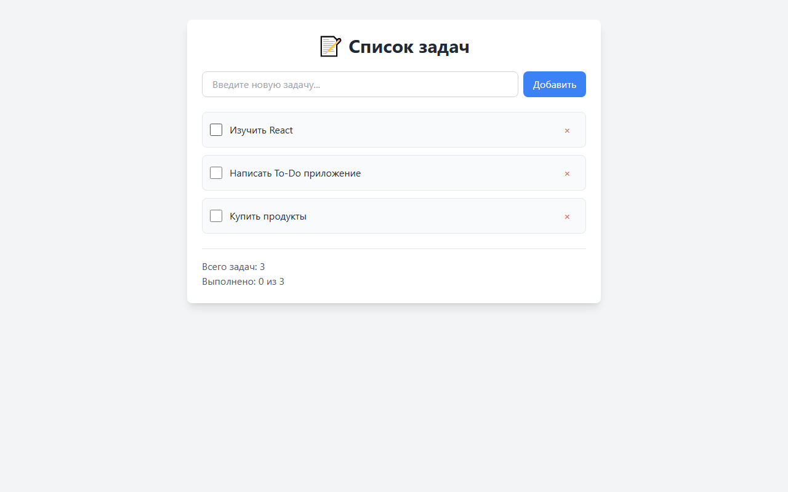
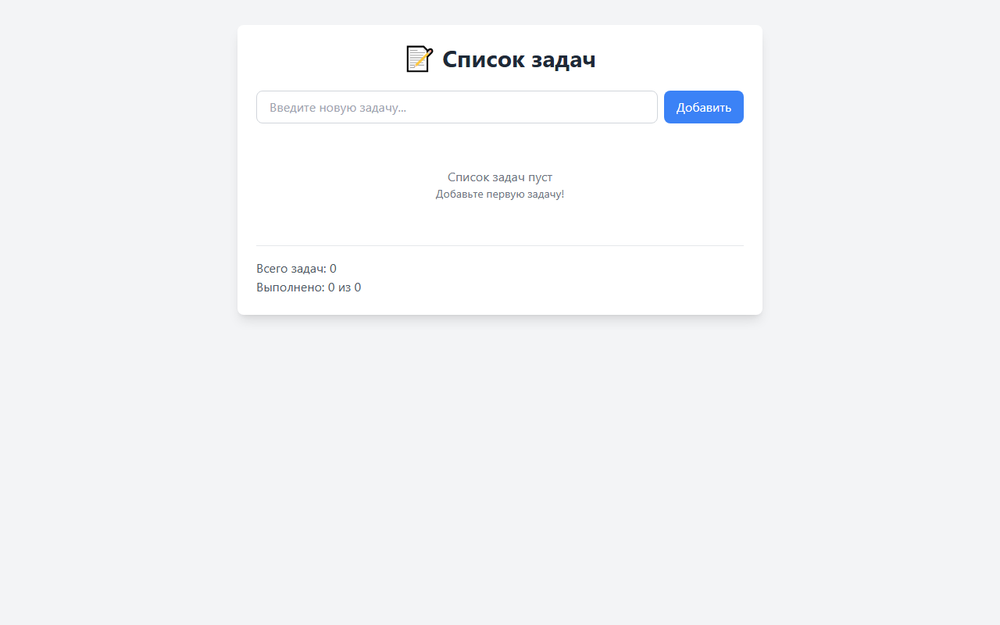
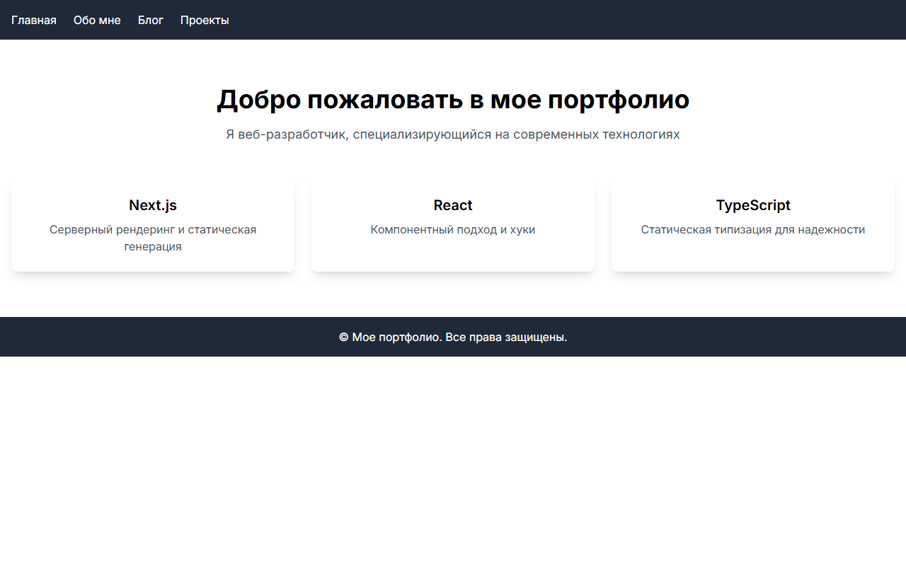
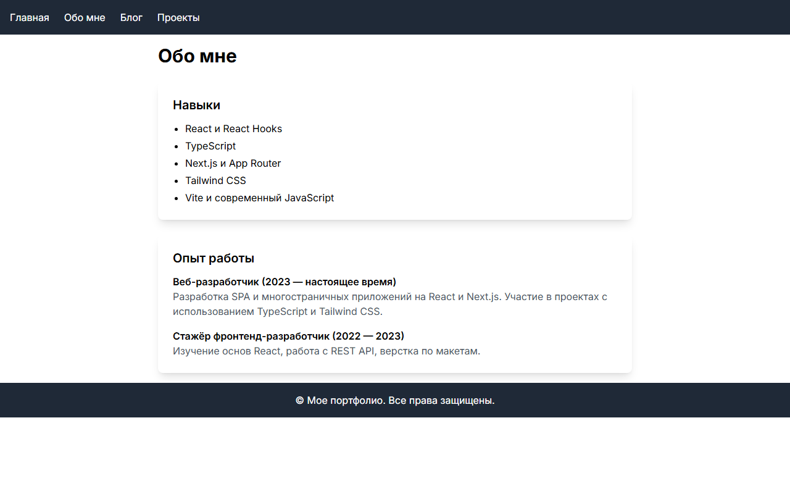
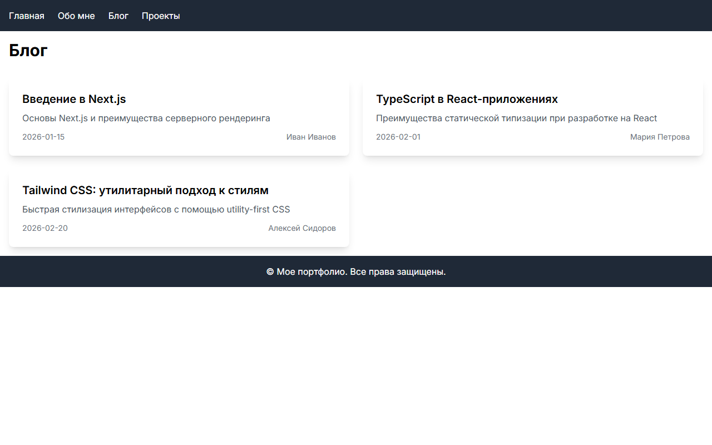
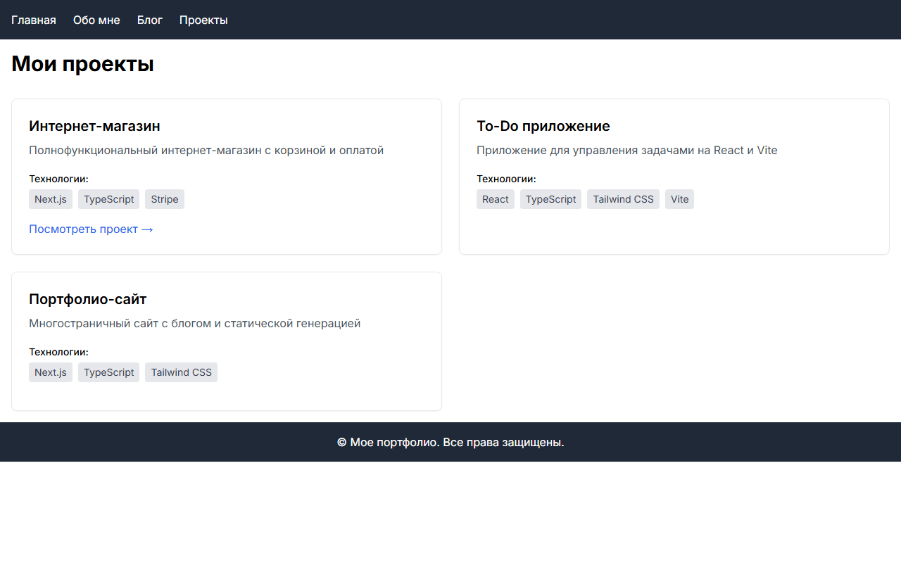
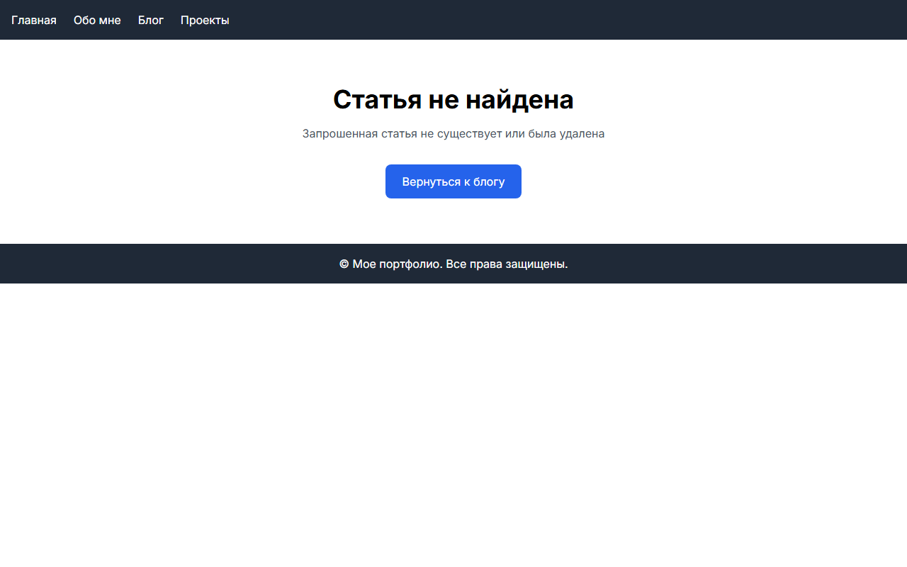
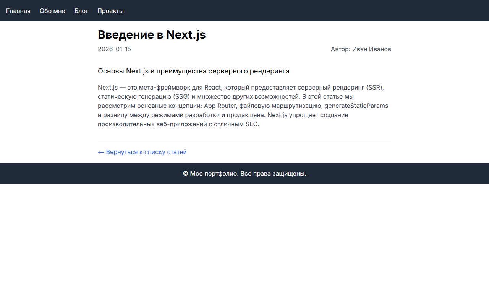

# Отчет по лабораторной работе №10
# Часть 1 и 2: React + Vite и Next.js

**Дата:** 2026-03-04  

**Семестр:** 2 курс 2 полугодие (4 семестр)  

**Группа:** ПИН-б-о-24-1(1)  

**Дисциплина:** Технологии программирования  

**Студент:** Быханов Михаил Сергеевич

---

## Цель работы

**Часть 1:** Практическое знакомство с созданием React-приложений с использованием TypeScript и Vite. Освоение базовых концепций компонентного подхода и управления состоянием. Разработка приложения для управления списком задач (To-Do List) с реализацией функций добавления, удаления, отметки выполнения, статистики и обработки пустого списка.

**Часть 2:** Практическое знакомство с Next.js — мета-фреймворком для React. Освоение концепций серверного рендеринга (SSG), файловой маршрутизации и создания многостраничного сайта-портфолио с блогом и проектами.

---

## Теоретическая часть

### Изученные концепции (Часть 1 — React + Vite)

#### 1. **React и компонентный подход**
- **Функциональные компоненты** — основа современного React. Они принимают `props` и возвращают JSX.
- **Хуки** — способ использовать состояние и другие возможности React в функциональных компонентах. Основные: `useState`, `useEffect`.

#### 2. **TypeScript**
- Статическая типизация, интерфейсы (`interface`) и типы (`type`).
- Повышение надёжности кода за счёт проверки типов на этапе компиляции.
- Автодополнение и документация в IDE.

#### 3. **Vite**
- Современный сборщик и инструмент разработки.
- Быстрая холодная и горячая замена модулей (HMR).
- Минимальная конфигурация.

#### 4. **Tailwind CSS**
- Утилитарный CSS-фреймворк для быстрой стилизации.
- Настройка через `tailwind.config.js`.
- Использование классов непосредственно в JSX.

#### 5. **Управление состоянием**
- Хук `useState` для локального состояния компонента.
- **Неизменяемость состояния** — ключевой принцип React. Состояние нельзя мутировать напрямую; нужно создавать новые копии объектов/массивов.

#### 6. **Методы массивов для работы с состоянием**
- `filter` — для удаления элементов (создаёт новый массив).
- `map` — для обновления элементов (создаёт новый массив).
- `...` (spread) — для копирования объектов.

### Изученные концепции (Часть 2 — Next.js)

#### 7. **Next.js и App Router**
- Файловая маршрутизация: структура папок в `app/` определяет URL.
- `layout.tsx` — общий макет для страниц.
- `page.tsx` — содержимое страницы.

#### 8. **SSG (Static Site Generation)**
- Страницы генерируются на этапе сборки (`npm run build`).
- `generateStaticParams` — предварительная генерация путей для динамических маршрутов.

#### 9. **Динамические маршруты**
- Папка `[slug]` — динамический сегмент URL.
- Параметр `params` передаётся в компонент страницы.

---

## Практическая часть

### Часть 1: To-Do приложение (todo-app)

#### Выполненные задачи

- [x] **Задача 1: Настройка проекта**
  - Создан проект с помощью Vite: `npm create vite@latest todo-app -- --template react-ts`
  - Установлены зависимости и Tailwind CSS версии 3

- [x] **Задача 2: Реализация интерфейса и базовых функций**
  - Создан компонент `App` с состоянием `tasks` и `newTask`
  - Реализована функция добавления задачи `addTask`

- [x] **Задача 3: Реализация удаления задач (обязательное А)**
  - Функция `removeTask` использует метод `filter` для создания нового массива без удаляемой задачи

- [x] **Задача 4: Реализация переключения статуса (обязательное B)**
  - Функция `toggleTask` использует метод `map` для создания нового массива с инвертированным полем `completed`

- [x] **Задача 5: Добавление кнопки удаления (обязательное C)**
  - Кнопка содержит символ `×` и стилизована для лучшего UX

- [x] **Задача 6: Статистика выполненных задач (дополнительное D)**
  - Подсчёт и отображение: "Выполнено: X из Y"

- [x] **Задача 7: Обработка пустого списка (дополнительное E)**
  - При отсутствии задач показывается информационное сообщение

#### Ключевые фрагменты кода (Часть 1)

```tsx
const removeTask = (id: number) => {
  setTasks(tasks.filter((task) => task.id !== id));
};

const toggleTask = (id: number) => {
  setTasks(
    tasks.map((task) =>
      task.id === id ? { ...task, completed: !task.completed } : task
    )
  );
};
```

---

### Часть 2: Сайт-портфолио (portfolio-site)

#### Выполненные задачи

- [x] **Задача 1: Настройка проекта**
  - Создан проект Next.js с TypeScript и Tailwind

- [x] **Задача 2: Страница "Обо мне"**
  - Блок «Навыки» — 5 пунктов (React, TypeScript, Next.js, Tailwind CSS, Vite)
  - Блок «Опыт работы» — 2 пункта

- [x] **Задача 3: Страница "Блог"**
  - Массив статей в `app/blog/data.ts` (3 статьи)
  - Список статей с ссылками на динамические страницы

- [x] **Задача 4: Динамические страницы статей**
  - `app/blog/[slug]/page.tsx` — поиск по slug, отображение контента, `notFound()` при отсутствии
  - `generateStaticParams` для предварительной генерации

- [x] **Задача 5: Страница 404**
  - `app/blog/[slug]/not-found.tsx` — сообщение и ссылка «Вернуться к блогу»

- [x] **Задача 6: Компонент ProjectCard**
  - Интерфейс `ProjectCardProps`, технологии в виде тегов

- [x] **Задача 7: Страница "Проекты"**
  - Массив из 3 проектов, рендер через `ProjectCard`

#### Ключевые фрагменты кода (Часть 2)

**blog/[slug]/page.tsx:**
```tsx
export async function generateStaticParams() {
  return blogPosts.map((post) => ({ slug: post.slug }));
}

export default function BlogPostPage({ params }: { params: { slug: string } }) {
  const post = blogPosts.find((p) => p.slug === params.slug);
  if (!post) notFound();
  // ...
}
```

**ProjectCard — технологии в виде тегов:**
```tsx
{technologies.map((tech) => (
  <span key={tech} className="inline-block px-2 py-1 bg-gray-200 text-gray-700 rounded text-sm">
    {tech}
  </span>
))}
```

---

## Результаты выполнения

### Часть 1: To-Do приложение

**Главный экран с задачами**

  
*Две задачи, одна выполнена (зачёркнута). Статистика: "Всего задач: 2", "Выполнено: 1 из 2".*

**Добавление новой задачи**

  
*Пользователь вводит текст и нажимает «Добавить». Новая задача появляется в списке.*

**Задача в состоянии «выполнено»**

  
*После клика по чекбоксу задача отмечается как выполненная (текст перечёркнут, статистика обновляется).*

**Удаление задачи**

  
*При нажатии на крестик задача исчезает, список и статистика обновляются.*

**Пустой список**

  
*Сообщение «Список задач пуст. Добавьте первую задачу!».*

### Часть 2: Портфолио

**Главная страница**

  
*Приветствие и карточки технологий (Next.js, React, TypeScript).*

**Страница «Обо мне»**

  
*Блоки «Навыки» и «Опыт работы».*

**Страница «Блог»**

  
*Список статей с ссылками на динамические страницы.*

**Страница «Проекты»**

  
*Карточки проектов с компонентом ProjectCard.*

**Страница 404**

  
*Сообщение «Статья не найдена» для несуществующих статей блога.*

**Страница статьи блога**

  
*Полный текст статьи «Введение в Next.js» с датой, автором и ссылкой «Вернуться к блогу».*

**Страницы:**
- Главная (`/`) — приветствие и карточки технологий
- Обо мне (`/about`) — навыки и опыт работы
- Блог (`/blog`) — список из 3 статей
- Статья (`/blog/[slug]`) — полный текст статьи
- Проекты (`/projects`) — 3 проекта с компонентом ProjectCard
- 404 — для несуществующих статей блога

**Результат сборки Next.js:**
```
Route (app)                    Size     First Load JS
○ /                            146 B    87.4 kB
○ /about                       146 B    87.4 kB
○ /blog                        180 B    96.1 kB
● /blog/[slug]                 180 B    96.1 kB
○ /projects                    146 B    87.4 kB
```

---

## Ответы на контрольные вопросы

### Часть 1 (React + Vite)

#### 1. Объясните принцип работы хука `useState`

**Ответ:**  
`useState` — хук, добавляющий состояние в функциональный компонент. Принимает начальное значение и возвращает массив: текущее значение и функцию обновления. При вызове функции обновления React перерисовывает компонент.

#### 2. Почему в React важно использовать неизменяемое состояние?

**Ответ:**  
React сравнивает предыдущее и новое состояние. При прямой мутации (например, `tasks.push()`) ссылка на массив не меняется, React не обнаруживает изменений, интерфейс не обновляется. Неизменяемость гарантирует создание новой ссылки и корректный рендеринг.

#### 3. Какой метод массива вы использовали для удаления задачи и почему?

**Ответ:**  
Метод `filter`. Он создаёт новый массив без удаляемого элемента, не мутирует исходный массив и соответствует принципу неизменяемости.

#### 4. В чём преимущества TypeScript при разработке React-приложений?

**Ответ:**  
Статическая типизация, обнаружение ошибок на этапе компиляции, автодополнение в IDE, документирование через интерфейсы, безопасный рефакторинг.

### Часть 2 (Next.js)

#### 5. Что такое SSG (Static Site Generation) и как он реализован в вашем проекте?

**Ответ:**  
SSG — генерация HTML на этапе сборки. В проекте все страницы (главная, о себе, блог, проекты, статьи) помечены как статические (○ или ●). `generateStaticParams` предварительно генерирует пути для `/blog/[slug]`.

#### 6. Как работает файловая маршрутизация в Next.js?

**Ответ:**  
Структура папок в `app/` определяет URL: `app/page.tsx` → `/`, `app/about/page.tsx` → `/about`, `app/blog/[slug]/page.tsx` → `/blog/:slug`. Папка `[slug]` — динамический сегмент.

#### 7. Какие преимущества даёт использование `generateStaticParams`?

**Ответ:**  
Next.js заранее знает все возможные пути для динамического маршрута и генерирует HTML при сборке. Страницы загружаются быстрее, не требуют серверного рендеринга при запросе.

#### 8. В чём разница между `npm run dev` и `npm run build`?

**Ответ:**  
`npm run dev` — режим разработки с HMR, страницы рендерятся по запросу. `npm run build` — сборка продакшен-версии, статические страницы генерируются заранее, результат в папке `.next`.

---

## Приложения

### Исходный код App.tsx (todo-app)

```tsx
import { useState } from 'react';

interface Task {
  id: number;
  text: string;
  completed: boolean;
}

const INITIAL_TASKS: Task[] = [
  { id: 1, text: 'Изучить React', completed: true },
  { id: 2, text: 'Написать To-Do приложение', completed: false },
];

function App() {
  const [tasks, setTasks] = useState<Task[]>(INITIAL_TASKS);
  const [newTask, setNewTask] = useState('');

  const addTask = () => {
    if (newTask.trim() === '') return;
    const task: Task = {
      id: Date.now(),
      text: newTask,
      completed: false,
    };
    setTasks([...tasks, task]);
    setNewTask('');
  };

  const removeTask = (id: number) => {
    setTasks(tasks.filter((task) => task.id !== id));
  };

  const toggleTask = (id: number) => {
    setTasks(
      tasks.map((task) =>
        task.id === id ? { ...task, completed: !task.completed } : task
      )
    );
  };

  const completedCount = tasks.filter((task) => task.completed).length;

  return (
    <div className="min-h-screen bg-gray-100 p-8">
      <div className="max-w-2xl mx-auto bg-white rounded-lg shadow-lg p-6">
        <h1 className="text-3xl font-bold text-center mb-6 text-gray-800">
          📝 Список задач
        </h1>
        <div className="flex gap-2 mb-6">
          <input
            type="text"
            value={newTask}
            onChange={(e) => setNewTask(e.target.value)}
            onKeyDown={(e) => e.key === 'Enter' && addTask()}
            placeholder="Введите новую задачу..."
            className="flex-grow px-4 py-2 border border-gray-300 rounded-lg focus:outline-none focus:ring-2 focus:ring-blue-500"
          />
          <button
            onClick={addTask}
            className="px-4 py-2 bg-blue-500 text-white rounded-lg hover:bg-blue-600 transition"
          >
            Добавить
          </button>
        </div>
        {tasks.length === 0 ? (
          <div className="text-center py-8 text-gray-500">
            <p>Список задач пуст</p>
            <p className="text-sm">Добавьте первую задачу!</p>
          </div>
        ) : (
          <div className="space-y-3">
            {tasks.map((task) => (
              <div
                key={task.id}
                className="flex items-center justify-between p-3 bg-gray-50 rounded-lg border"
              >
                <div className="flex items-center gap-3">
                  <input
                    type="checkbox"
                    checked={task.completed}
                    onChange={() => toggleTask(task.id)}
                    className="h-5 w-5 text-blue-600"
                  />
                  <span
                    className={`${task.completed ? 'line-through text-gray-500' : 'text-gray-800'}`}
                  >
                    {task.text}
                  </span>
                </div>
                <button
                  onClick={() => removeTask(task.id)}
                  className="px-3 py-1 text-red-500 hover:text-red-700 hover:bg-red-50 rounded transition"
                  aria-label="Удалить задачу"
                >
                  ×
                </button>
              </div>
            ))}
          </div>
        )}
        <div className="mt-6 pt-4 border-t">
          <p className="text-gray-600">Всего задач: {tasks.length}</p>
          <p className="text-gray-600">
            Выполнено: {completedCount} из {tasks.length}
          </p>
        </div>
      </div>
    </div>
  );
}

export default App;
```

---

### Инструкция по запуску

#### Часть 1: To-Do приложение

```bash
cd lab-10/todo-app
npm install
npm run dev
```

Открыть браузер: `http://localhost:5173`

#### Часть 2: Портфолио

```bash
cd lab-10/portfolio-site
npm install
npm run dev
```

Открыть браузер: `http://localhost:3000`

- Главная: http://localhost:3000
- Обо мне: http://localhost:3000/about
- Блог: http://localhost:3000/blog
- Статья: http://localhost:3000/blog/introduction-to-nextjs
- Проекты: http://localhost:3000/projects
- 404 (несуществующая статья): http://localhost:3000/blog/nonexistent
